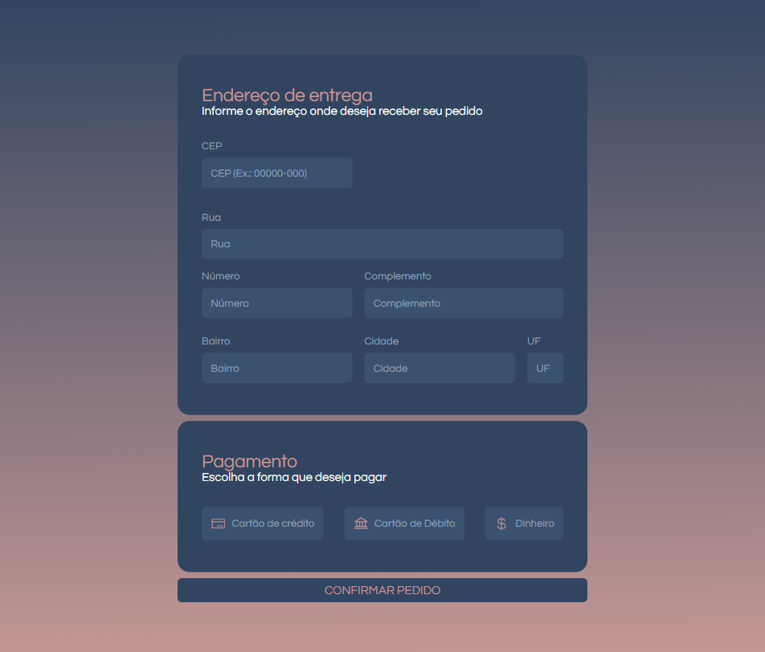
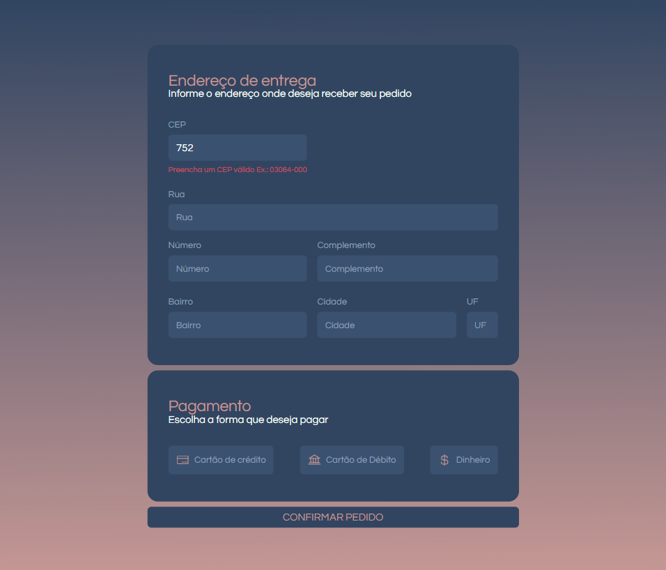
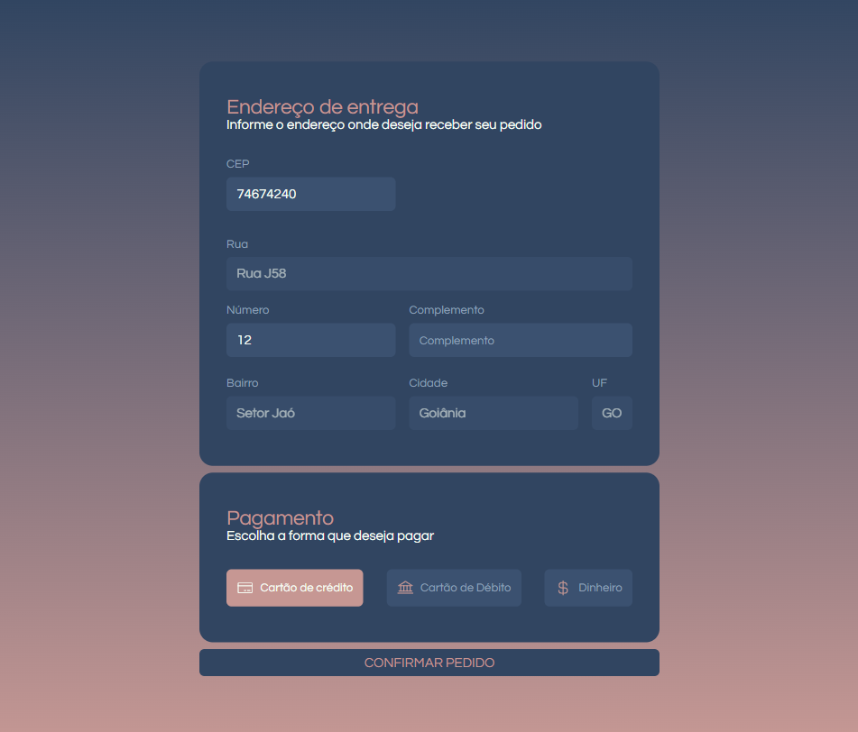
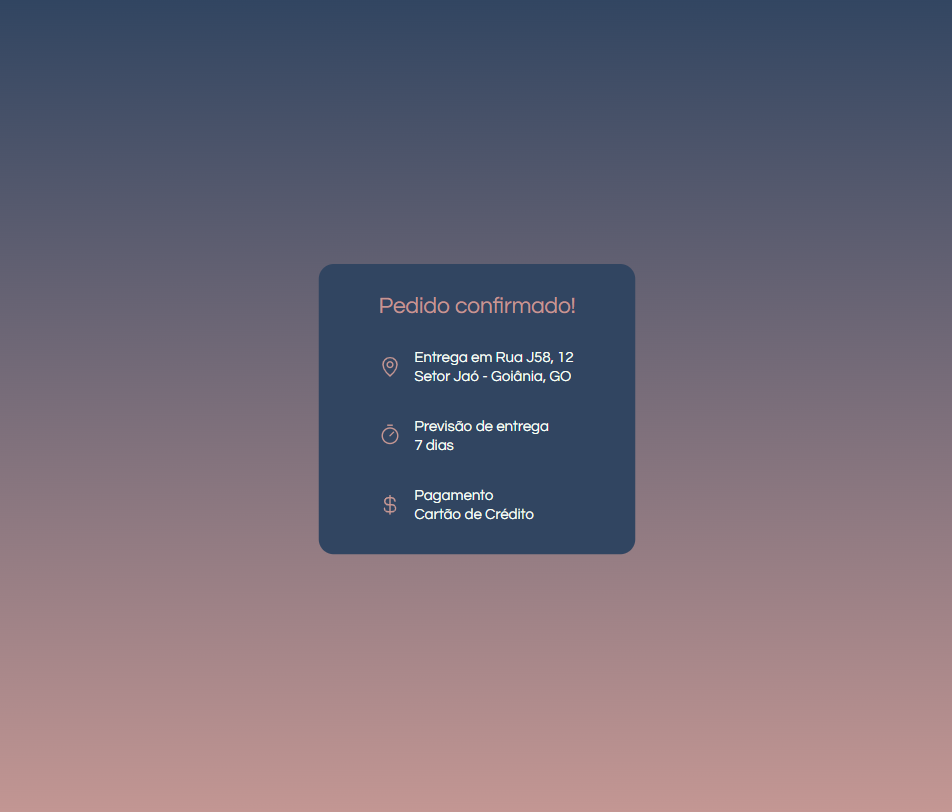

# api-form

O API Form é um projeto desenvolvido com o intuito de compartilhar conhecimento, através da publicação de um tutorial escrito no LinkedIn (em breve link da publicação), e quem sabe até um vídeo no YouTube.
 
O objetivo do projeto é mostrar como se consome uma API com React e como fazemos a interação entre formulários uncontrolled e controlled. Desta forma, desenvolvi um formulário simples no Figma com duas páginas, a primeira delas com o formulário e a segunda a confirmação de submissão do formulário, trazendo as informações dos inputs.

## Ferramentas para desenvolvimento

- Layout [Figma](https://www.figma.com/file/jv2ZERt4HZlhDYoAsAYEOu/Formul%C3%A1rio-de-entrega?node-id=3%3A70);
- Styled-components para estilização;
- React Router Dom para criar as rotas da aplicação;
- React Hook Form e Zod para trabalhar e validar os inputs;
- API Via CEP para trazer as informações de rua, cidade, bairro e uf;
- Radix UI, utilizando o componente de ratio group para seleção da forma de pagamento.

## Deploy da aplicação

"Em breve"
 
Para abrir o projeto em localhost basta digitar o comando `npm run dev`.

## Vídeo da aplicação

"Em breve"

## Design da aplicação

## Dados complementares

- Autor: [Yasmin](https://www.linkedin.com/in/yasmin-goncalves/)

 
